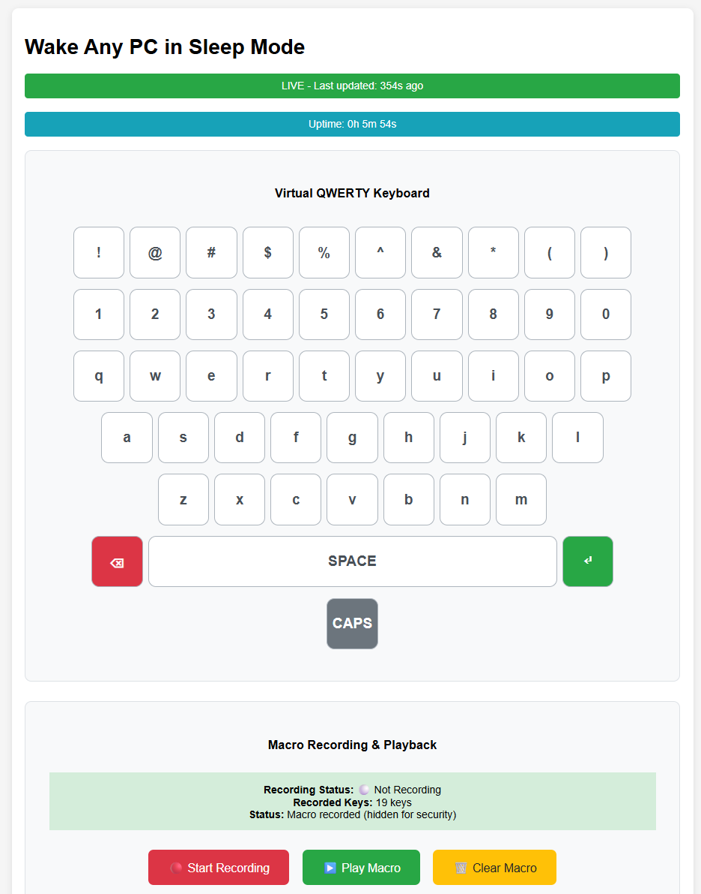
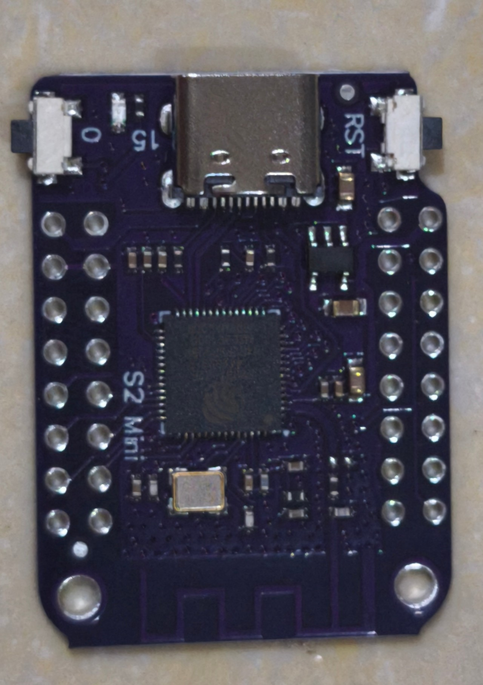

# ESP32 Wake Any PC from Sleep Mode

A powerful ESP32-S2 project that provides a web-based interface to control a USB HID keyboard with hardware reset capabilities. This project is specifically designed to solve USB HID issues that commonly occur when MacBooks go to sleep and wake up.



## Features

- **Web-based Control Interface**: Access your ESP32-S2 from any device on your network
- **USB HID Keyboard Emulation**: Send keyboard inputs to connected computers
- **Hardware Reset Capability**: Complete ESP32 restart when USB gets stuck
- **WiFi Configuration**: Easy setup and monitoring via web interface
- **Access Point Mode**: Automatic WiFi setup with captive portal
- **Real-time Status Monitoring**: Live updates of WiFi, USB, and keyboard status
- **Auto-recovery**: Automatic reconnection after hardware resets
- **Persistent Storage**: WiFi credentials saved in flash memory

## Hardware Requirements

- **ESP32-S2 Development Board** (with USB-C or micro USB port)
- **USB Cable** (USB-C to USB-A or micro USB to USB-A)
- **Computer** (Windows, macOS, or Linux)



## Software Requirements

- **Arduino IDE** (version 1.8.19 or later)
- **ESP32 Board Package** (version 2.0.0 or later)

## Arduino IDE Setup for ESP32-S2

### Step 1: Install Arduino IDE
1. Download Arduino IDE from [arduino.cc](https://www.arduino.cc/en/software)
2. Install and launch Arduino IDE

### Step 2: Add ESP32 Board Manager
1. Open Arduino IDE
2. Go to **File** → **Preferences**
3. In **Additional Board Manager URLs**, add:
   ```
   https://raw.githubusercontent.com/espressif/arduino-esp32/gh-pages/package_esp32_index.json
   ```
4. Click **OK**

### Step 3: Install ESP32 Board Package
1. Go to **Tools** → **Board** → **Boards Manager**
2. Search for **"esp32"**
3. Find **"ESP32 by Espressif Systems"**
4. Click **Install** (this may take several minutes)
5. Click **Close**

### Step 4: Select ESP32-S2 Board
1. Go to **Tools** → **Board** → **ESP32 Arduino**
2. Select **"ESP32S2 Dev Module"** or your specific ESP32-S2 board
3. Configure board settings:
   - **USB CDC On Boot**: "Enabled"
   - **USB DFU On Boot**: "Enabled"
   - **USB Firmware MSC On Boot**: "Disabled"
   - **USB JTAG On Boot**: "Enabled"
   - **Core Debug Level**: "None"
   - **PSRAM**: "Disabled" (unless your board has PSRAM)
   - **Partition Scheme**: "Default 4MB with spiffs"
   - **Upload Speed**: "921600"

## Project Setup

### Step 1: Clone/Download Project
1. Download the `esp32_wake_any_pc.ino` file
2. Create a new folder named `esp32_wake_any_pc`
3. Place the `.ino` file inside this folder

### Step 2: Configure WiFi Settings via Access Point Mode

The ESP32-S2 will automatically create an Access Point (AP) for WiFi configuration when first powered on or when no WiFi credentials are saved.

1. **Power on your ESP32-S2** - it will automatically start in AP mode
2. **Connect to ESP32's WiFi network:**
   - Network Name: `WakeAnyPCEsp32`
   - Password: None (open network)
3. **Access the setup page:**
   - Your device will automatically open the WiFi setup page
   - Or manually navigate to: `http://192.168.1.1`
4. **Enter your WiFi credentials:**
   - WiFi Network Name (SSID)
   - WiFi Password
5. **Click "Connect to WiFi"** - ESP32 will save credentials and restart
6. **ESP32 will automatically connect** to your WiFi network

**Note**: AP mode automatically creates a captive portal that redirects all web requests to the WiFi setup page

### Step 3: Install Required Libraries
The project uses these built-in libraries (no additional installation needed):
- `WiFi.h` - WiFi connectivity
- `WebServer.h` - Web server functionality
- `USB.h` - USB functionality
- `USBHIDKeyboard.h` - HID keyboard emulation
- `esp_sleep.h` - Sleep management
- `Preferences.h` - Persistent storage for WiFi credentials
- `DNSServer.h` - Captive portal functionality

## Building and Flashing

### Step 1: Verify Code
1. Click the **Verify** button (✓) in Arduino IDE
2. Ensure no compilation errors

### Step 2: Enter Flash Mode
1. **IMPORTANT**: ESP32-S2 requires specific button sequence to enter flash mode
2. Hold down the **BOOT** button on your ESP32-S2 board
3. While holding BOOT, press and release the **RESET** button
4. Release the **BOOT** button
5. The board is now in flash mode and ready for programming

### Step 3: Install USB Drivers (if needed)
If Arduino IDE doesn't recognize the COM port:
- **Windows**: 
  - Install official ESP32-S2 drivers from Espressif: [Download ESP32-S2 Drivers](https://github.com/espressif/esp-win-usb-drivers/releases/tag/ESP32-S2_v1.0.0.0)
- **macOS**: Usually works out of the box
- **Linux**: May need to add user to dialout group: `sudo usermod -a -G dialout $USER`

### Step 4: Connect and Select Port
1. Connect your ESP32-S2 to your computer via USB
2. Wait for the board to be recognized
3. Go to **Tools** → **Port**
4. Select the COM port (Windows) or device path (macOS/Linux) where your ESP32-S2 appears

### Step 5: Flash the Code
1. Click the **Upload** button (→) in Arduino IDE
2. Wait for the upload to complete
3. You should see "Upload complete" message
4. **Note**: If upload fails, repeat the BOOT + RESET sequence and try again

## Usage

### Step 1: Access Web Interface
1. After successful upload, open Serial Monitor (Tools → Serial Monitor)
2. Set baud rate to **115200**
3. Look for the IP address in the serial output
4. Open a web browser and navigate to `http://[ESP32_IP_ADDRESS]`

### Step 2: Web Interface Features
- **Status Dashboard**: Real-time monitoring of WiFi, USB, and keyboard status
- **Send Key**: Send the 'A' key to test keyboard functionality
- **Hardware Reset**: Complete ESP32 restart (use when keyboard gets stuck)
- **Soft Reset**: USB-only reset (less effective)
- **Test Keyboard**: Test keyboard functionality

### Step 3: Troubleshooting Sleep Issues
When your MacBook wakes up and the keyboard doesn't work:
1. Access the web interface
2. Click **"Hardware Reset ESP32"** button
3. Wait 10-15 seconds for ESP32 to restart
4. Try **"Send A Key"** - should work now!

## WiFi Management

### Changing WiFi Settings
If you need to change WiFi credentials or connect to a different network:

1. **Access the web interface** when ESP32 is connected to WiFi
2. **Click "Reset WiFi Settings"** button
3. **Confirm the action** - this will delete saved credentials
4. **ESP32 will restart** and return to AP mode
5. **Follow the AP mode setup** again with new credentials

### AP Mode Features
- **Automatic Setup**: No manual configuration files needed
- **Captive Portal**: Automatically redirects to setup page
- **Persistent Storage**: Credentials saved in ESP32's flash memory
- **Easy Reset**: One-click WiFi reset from web interface

## Troubleshooting

### Common Issues

#### Upload Fails
- **Solution**: Hold the **BOOT** button on ESP32-S2 while clicking Upload
- **Alternative**: Try different USB cable or port

#### Board Not Recognized
- **Solution**: Install proper USB drivers for your operating system
- **Windows**: Install CP210x or CH340 drivers
- **macOS**: Usually works out of the box
- **Linux**: May need to add user to dialout group

#### WiFi Connection Issues
- **Solution**: Use AP mode to reconfigure WiFi settings
- **Alternative**: Ensure 2.4GHz WiFi (ESP32-S2 doesn't support 5GHz)
- **AP Mode**: If ESP32 starts in AP mode, connect to `WakeAnyPCEsp32` network and access `192.168.1.1`

#### Keyboard Not Working
- **Solution**: Use **"Hardware Reset ESP32"** button
- **Prevention**: Avoid putting MacBook to sleep while ESP32 is connected

### Serial Monitor Output
Monitor these messages for debugging:
- `=== ESP32-S2 Hardware Reset Keyboard Starting ===`
- `USB HID initialized`
- `WiFi connected! IP: [IP_ADDRESS]`
- `=== Setup Complete ===`

## Technical Details

### Architecture
- **Microcontroller**: ESP32-S2 (240MHz, 320KB SRAM)
- **USB**: Native USB support with HID keyboard emulation
- **WiFi**: 802.11 b/g/n (2.4GHz only)
- **Web Server**: Built-in HTTP server on port 80

### Power Requirements
- **Operating Voltage**: 3.3V
- **USB Power**: 5V via USB connection
- **Current Draw**: ~100-200mA during operation

### Memory Usage
- **Flash**: ~1.5MB (out of 4MB total)
- **SRAM**: ~200KB (out of 320KB total)
- **SPIFFS**: Available for additional storage

## Contributing

1. Fork the repository
2. Create a feature branch
3. Make your changes
4. Test thoroughly
5. Submit a pull request

## License

This project is open source. Feel free to modify and distribute according to your needs.

## Support

For issues and questions:
1. Check the troubleshooting section above
2. Review the serial monitor output
3. Ensure proper hardware connections
4. Verify Arduino IDE configuration

## Version History

- **v1.0.0**: Initial release with basic keyboard functionality
- **v1.1.0**: Added hardware reset capability
- **v1.2.0**: Enhanced web interface and monitoring
- **v1.3.0**: Added Access Point mode for easy WiFi setup

---

**Note**: This project is specifically designed for ESP32-S2 boards. ESP32 (non-S2) boards may require modifications due to different USB implementations. 